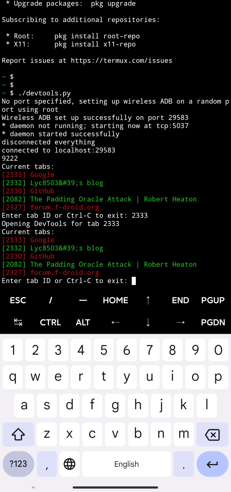
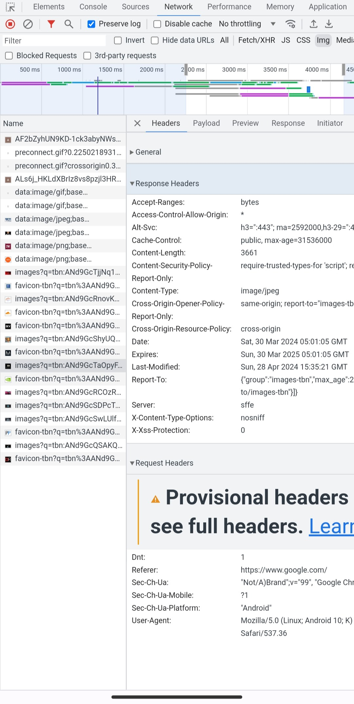
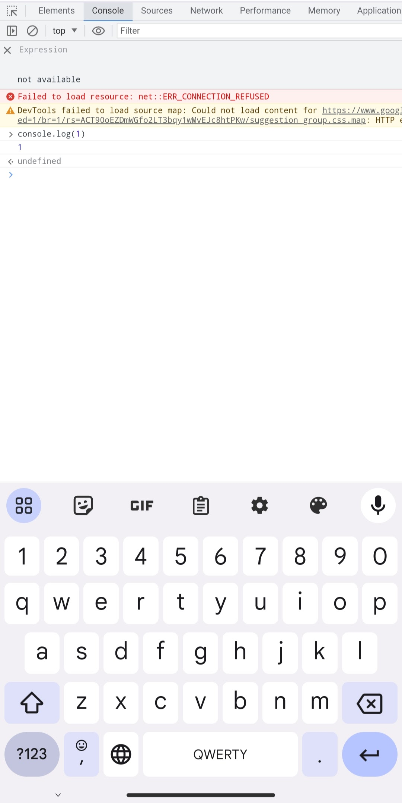

# AndroidChromeDevTools

### Overview

This is a tool that allows you to use the full-featured Chrome DevTools on your Android device just like you would on a PC. This is particularly useful for web developers who want to debug and inspect web pages directly on their mobile devices.

With AndroidChromeDevTools, you can inspect elements, debug JavaScript, analyze network and performance, and much more, all directly from your Android device.

<p float="left">
  
   
  
</p>

### Prerequisites

- An Android phone with Chrome installed (of course)
- [Termux](https://termux.dev/en/) installed on your phone (Install this useful tool if you haven't yet)

### Setup

Open termux and run following commands to retrieve the script and install the necessary dependencies.

```bash
# Update existing packages (to avoid weird issues)
pkg up

# We need python3 and adb
apt install python android-tools -y

pip3 install websockets aiohttp

curl -o devtools.py https://raw.githubusercontent.com/lyc8503/AndroidChromeDevTools/main/devtools.py
chmod +x devtools.py
```

### Usage

#### For non-rooted users

Our script uses ADB to connect to Chrome DevTools, without ROOT you will need to manually enable Wireless ADB debugging with a PC. **This only needs to be done once until you reboot your phone.**

You need to enable ADB debugging for your phone first and then connect it to any computer and run `adb tcpip 1234` on the computer, where 1234 can be any port number you like.

Go back to the phone and start Termux, using `./devtools.py 1234` to run this script, where 1234 is the port number you just used. Until you reboot your phone, you can just run the script again without the need for a computer.

#### For rooted users

Using this script on a phone with ROOT access is even easier, just open Termux and run `. /devtools.py` (no additional arguments required).

### Troubleshooting

Chrome often closes itself in the background to save memory. If a connection failure occurs, switch to Chrome, confirm that Chrome and the tab you need to debug are still running, and then try again.

If the problem still persists, please [raise an issue](https://github.com/lyc8503/AndroidChromeDevTools/issues) in this repo and attach the FULL log.
